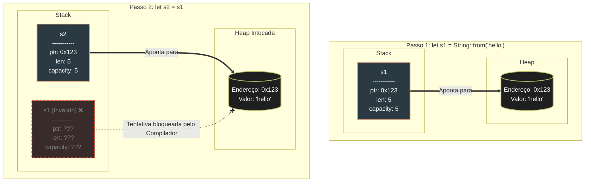
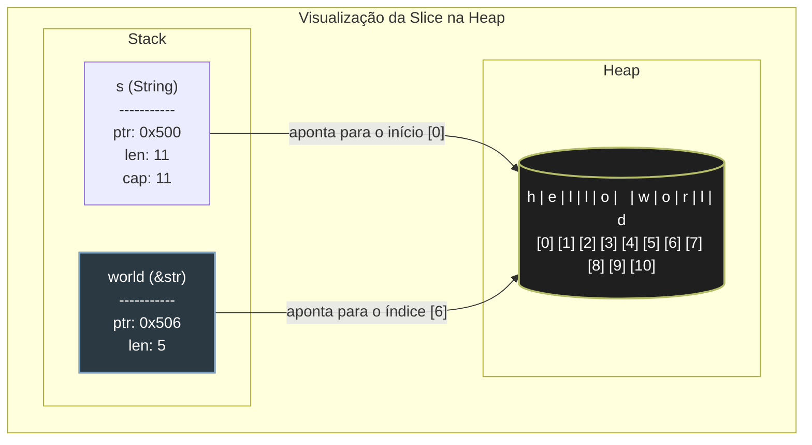

# [Compreendendo Ownership](https://doc.rust-lang.org/book/ch04-01-what-is-ownership.html)

O _Ownership_(propriedade) é um conceito exclusivo do rust, a memoria é gerenciada pelo sistema de propriedades com um conjunto de regras que devem ser seguidas. Se qualquer uma das regras é violada, o programa simplemente não compila.

Basicamente quando estamos tratando de rust precisamos ter em mente dois grupos de memoria, `stack`(_pilha_) e `heap`(_monte_).

- `stack` é a memoria rápida, onde colocamos nossos valores um em cima do outro. Como uma _pilha_ de pratos. Ela é mais performática por é mais rápido para um processador andar poucas casas até o práximo valor, além de ele sempre saber onde estão os valores, na _pilha_.

- `heap` podemos interpretar como um _monte_ de coisas que jogamos, apenas encontramos um lugar onde cabe aquele valor e deixamos lá, retornando o ponteiro para a `stack`. Para um processador chegar a esse valor é mais caro, pois sempre precisa seguir o ponteiro.

## Memória: Stack vs. Heap

- `Stack` (_Pilha_): Armazena dados com tamanho fixo e conhecido em tempo de compilação. É extremamente rápida.

- `Heap` (_Monte_): Armazena dados cujo tamanho pode mudar (como uma `String` ou um `Vec`). O sistema operacional aloca um espaço, marca-o como ocupado e retorna um ponteiro (o endereço de onde o dado está).



## Regras de Ouro

O sistema de Ownership é regido por três regras que o compilador verifica rigidamente:

1. Cada valor em Rust tem uma variável que é chamada de seu **owner (dono)**.

2. Só pode haver um dono por vez.

3. Quando o dono sai de escopo, o valor é **descartado (dropped)**.

### O que acontece na prática?

Diferente de linguagens como Python ou JavaScript, quando você atribui uma variável que aponta para a `Heap` a outra variável, o Rust não faz uma cópia. Ele realiza um **_Move (Movimento)_**.

```rust
let s1 = String::from("hello");
let s2 = s1;

// println!("{}", s1); // Isso causaria um erro de compilação!
// O "dono" agora é s2. s1 foi invalidada.
```

## Referenciando e Borrowing (Empréstimo)

Se não quisermos perder a posse de um valor toda vez que passamos ele para uma função, usamos Referências (&). Isso é chamado de Borrowing.

- **Imutável (`&T`):** Você pode ter várias leituras ao mesmo tempo.

- **Mutável (`&mut T`):** Você só pode ter uma única referência mutável por vez (evitando data races).

```rust
fn main() {
    let s1 = String::from("hello");

    let len = calculate_length(&s1);

    println!("The length of '{s1}' is {len}.");
}

fn calculate_length(s: &String) -> usize {
    s.len()
}
```

Oque está ocorrendo na verdade é isso:

<div align="center">
    
</div>

### [Dangling References](https://doc.rust-lang.org/book/ch04-02-references-and-borrowing.html#dangling-references)

As Regras de Referências

- A qualquer momento, você pode ter ou uma referência mutável ou qualquer número de referências imutáveis.
- As referências devem ser sempre válidas.

## [O tipo de fatia(Slice)](https://doc.rust-lang.org/book/ch04-03-slices.html#the-slice-type)

Slices (fatias) permitem que você referencie uma **sequência contígua**(Com endereços de memoria coladinhos) de elementos dentro de uma coleção, em vez de referenciar a coleção inteira.

Diferente de uma `String` ou um `Vec`, o Slice é um tipo de referência, o que significa que ele não possui ownership (propriedade) dos dados. Ele apenas "aponta" para onde os dados começam e diz quantos elementos devem ser lidos a partir dali.

### [Slices de Strings(&str)](https://doc.rust-lang.org/book/ch04-03-slices.html#string-slices)

Uma fatia de string é uma referência a uma parte de uma `String`. Na memória, ela é representada por dois valores na `stack`: um ponteiro para o ponto inicial e o tamanho (comprimento) da fatia.

```rust
let s = String::from("hello world");

let hello = &s[0..5];  // "hello"
let world = &s[6..11]; // "world"
```



### [Outros Slices](https://doc.rust-lang.org/book/ch04-03-slices.html#other-slices)

Embora fatias de strings sejam as mais comuns, você pode usar slices para qualquer coleção contígua, como arrays:

```rust
let a = [1, 2, 3, 4, 5];

let sliced_a = &a[1..3]; // Referencia os elementos [2, 3]
```
